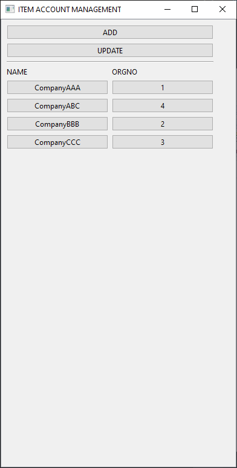

# Item-Client
A frontend application that utilizes [Item-RestAPI Server](https://github.com/khiemhtd/item-restapi).
Item Client has following features
- Lists all accounts
- Add Account
- Refresh account list
- Edit account

# Requirements
- Python 3.6+ installed
- Package [requests](https://pypi.org/project/requests/2.7.0/) installed
- Package [pyside6](https://www.qt.io/qt-for-python) installed
- Host/IP and port of a running Item-RestAPI server

# Commandline Client
This package includes a commandline client for quick or automated testing. To use it you can make calls to `item_client.client`. Use argument `--help` for more information on how to use it.
Usage:
```
> cd /path/to/item-client
> python -m item_client.client -h
usage: client.py [-h] [-v] [--ip IP] [--port PORT] [--log-file LOG_FILE] {test,account,accounts,add,edit,delete} ...

Item's Client

optional arguments:
  -h, --help            show this help message and exit
  -v, --verbose         increase log output verbosity
  --ip IP, -i IP        The Rest API server's ip address
  --port PORT, -p PORT  The Rest API server's port
  --log-file LOG_FILE, -l LOG_FILE
                        Output logs to specified file

command:
  {test,account,accounts,add,edit,delete}
                        Command Type
    test                Simple test, useful for checking connection
    account             Given account id, get account info
    accounts            Get all accounts or get n accounts if n is provided, accounts will be in alphabetical order
    add                 Add an account
    edit                Edit an account
    delete              Given account id, delete account info
```

E.g. adding an account
```
> cd /path/to/item-client
> python -m item_client.client add --data '{\"name\":\"companyFFF\", \"orgno\": 6, \"leader_title\": \"manager\", \"leader_name\": \"someone\", \"type\": \"industrial\"}'
```
Sample response
```
{'id': 4, 'result': True, 'message': 'Account 6 added successfully'}
```

# Usage
To start the main application run `item_client.main` from the root folder of this repo:
```
> cd /path/to/item-client
> python -m item_client.main
```
You should see something like the following\


If you click on a company name or a organisation number, you should see the Edit Account form\


If you click on ADD, you should see the Add Account form\


Clicking on UPDATE should update the view with latest account information and add new accounts if there are any.

# Bug
- All errors will display a dialog that has a window title of "FATAL ERROR" despite not being fatal
- Edit Account does not check if user actually changed any fields and will submit edit request even if nothing was changed
- UPDATE button does not sort views

# Thoughts
There's always improvements that could be made. Here are some thoughts if I were to continue working on this.
- Non-blocking HTTP requests, currently all HTTP calls will block, this causes a terrible user experience.
- Cleaner code, currently there is some clumsiness to how HTTP requests are handled and could be a lot cleaner
- Don't include "orgno" field in Edit Account form
